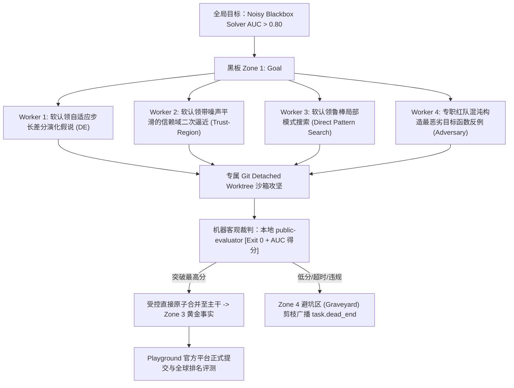

# Issue #7: E2E 终极验收 — Bohrium Playground 高维带噪黑盒极值算法蜂群攻坚

## 1. 目标与背景 (Context & Purpose)

在完成 Pi-Swarm 底层核心机制（去中心平权、四区黑板 CQRS、Git Detached Worktree 专属沙箱、机器客观裁判 Exit 0 门禁、受控直接原子合并协议）后，本 Ticket 作为**整个蜂群系统的终极端到端（E2E）验收测试**。

经过前置分析与单 Agent 实测验证，单点代码 Bug 仅需单 Agent 凭借局部上下文即可在 1 分钟内解决，无法检验多智能体协同价值。因此，本次终极验收采用深势科技（DP Technology）Bohrium 官方真实科研赛题：

- **赛题 ID**：`terminal-bench-science-v0-1-0-noisy-blackbox-optim-8ba810d5`
- **题目名称**：`Terminal-Bench Science: Noisy Blackbox Optimization`
- **考核核心**：在未知确定性高维噪声下，纯手写自研优化器算法 `/app/solver.py`，全面击败 SciPy Powell 算法（基线得分 0.50，目标得分 $> 0.80$）。

---

## 2. 独立比赛工作区与评测基准 (Workspace & Harness Setup)

- **专用比赛根目录**：`/home/dministrator/arena/noisy-blackbox-optim/`
- **官方题包与规范**：
  - `task.md`：赛题硬性约束（严禁外部现成优化库，纯数学与 NumPy 算法实现）
  - `datasets/`：官方评测测试用例集与 Docker 评估镜像上下文
- **客观机器裁判（Ground Truth Verifier）**：
  - 本地 Docker 隔离沙箱：`public-evaluator:latest`（`http://127.0.0.1:8080/evaluate`）
  - 本地快捷评测工具：`evaluator/evaluate.py --smoke`（10 题快速初筛）与 `--full`（64 题全集验证）
  - 机器判定标准：AUC 历史收敛积分，退出码 0 与严格浮点分值判定
- **ARM 轨迹与提交管道 (Trace & Playground CLI)**：
  - 轨迹路径：`traces/trace.jsonl`（经 `playground trace validate` 100% 格式合规验证）
  - 打包预检：`playground submit --dry-run` 自动校验 ARM Manifest 与 ZIP Bundle
  - 官方集群评测：`playground submit` 与 `playground status --attempt-id <ID>` 官方排行榜轮询

---

## 3. 蜂群协同攻坚架构 (Swarm Execution Model)

在 E2E 验收执行阶段，Pi-Swarm 将启动 **6~8 个地位平等的对等 Worker** 采用 DeepMind FunSearch 范式协同攻坚：

---

## 4. 验收完成标准 (Acceptance Criteria)

- [x] **比赛环境就绪**：`~/arena/noisy-blackbox-optim` 目录建立完毕，赛题包完整下载；
- [x] **本地评测沙箱闭环**：Docker 评测容器构建成功并健康运行，`evaluator.py` 跑通基线评估；
- [x] **ARM 轨迹与 CLI 打包跑通**：`playground trace validate` 与 `playground submit --dry-run` 预检通过；
- [ ] **Pi-Swarm 核心框架完工**：完成 Issue #3（Peer 发现与信令）与 Issue #5（全局状态与干预）；
- [ ] **蜂群 E2E 实测启动**：6~8 个节点在独立沙箱并发探索启发式算法，通过直接原子合并协议持续推高得分；
- [ ] **官方榜单与轨迹归档**：产出突破性 Solver 与完整 `trace.jsonl`，提交至 Bohrium 官方平台获取有效成绩。
